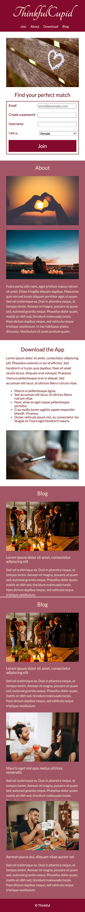
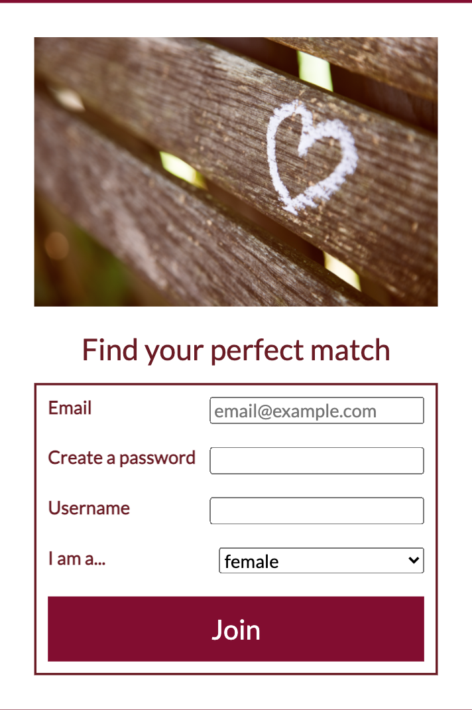
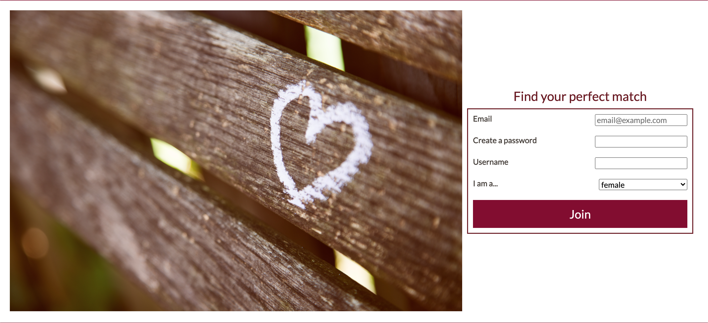
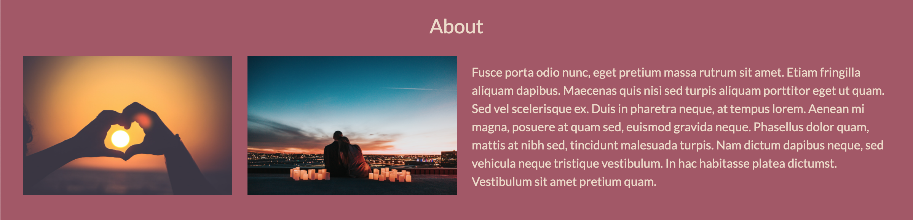
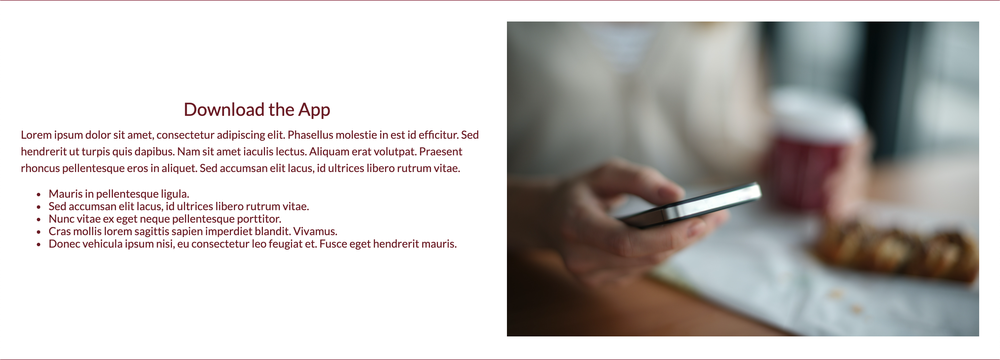

# ThinkfulCupid

ThinkfulCupid is an online dating and matchmaking website that allows people to meet, date, and network with each other. ThinkfulCupid uses a special algorithm that matches people based on their personality types. It also allows matches to connect with each other regardless of their locations via video conferencing.

The UX designer has provided me with the following user interface mockups:

### Mobile view

### Desktop view

#### Navigation

- The logo stacks on top of the menu links, which are aligned horizontally, as follows:

- **Single-page navigation**: I have modified the navigation links so that clicking on each link will take the user to the corresponding sections on the page, as follows:

| Link clicked | Take the user to the section with `id` of |
| ------------ | ----------------------------------------- |
| `Join`       | `id="join"`                               |
| `About`      | `id="about"`                              |
| `Download`   | `id="download"`                           |
| `Blog`       | `id="blog"`                               |

#### HTML form

- In the "Find your perfect match" section, I have created a form that contains the following input fields with the specified types:

  - `Email`: `email` input type, with a placeholder value of "email@example.com"
  - `Create a password`: `password` input type
  - `Username`: `text` input type
  - `I am a...`: a dropdown list with the following options:
    - female
    - male
    - other
  - a `"Join"` button

- CSS has been addded to the form so that
  - the labels (i.e., "Email", "Create a password", "Username", "I am a...") and their corresponding form fields are aligned towards the opposite ends of each row

The final form design will look as follows:

#### Vertical content alignment

- The content in the remainder of the sections (i.e., "About", "Download", "Blog"), including any text and images, stacks on top of each other. Refer to the mobile design shared above.

#### Responsive images

- The images will match whatever container width they are placed within, and changing the container sizes will update the image sizes appropriately.

#### Media query: Desktop view

In addition to your mobile design looking good, the website is also going to adapt the design for the desktop view.

Within the media query CSS is written to create the following designs for desktop:

- The logo and the navigation menu links is spaced apart from each other, like this:

- The "Find your perfect match" form is vertically centered to the right of the image, like this:

- The items in the "About" section are be horizontally aligned. The paragraph content is vertically centered and always be twice as wide as each image item, like this:

- The items in the "Download" section are horizontally aligned, and the paragraph item is as wide as the image item, like this:

- The blog posts in the "Blog" section are displayed in a 2 by 2 grid (see the desktop design shared above)
